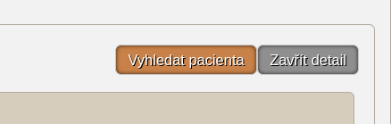
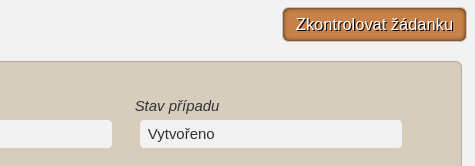

# PRO LAB

[Rozšíření do Mozilla Firefox](https://addons.mozilla.org/addon/pro-lab)

Rozšíření přidává užitečné funkce do registru ISIN, které systém propojují s modulem [Pacienti COVID-19](https://ereg.ksrzis.cz/Registr/CUDZadanky/VyhledaniPacienta) a [Žádanky testů COVID-19](https://eregpublicsecure.ksrzis.cz/Registr/CUD/Overeni) s cílem usnadnit práci s registrem.

## Zásady ochrany osobních údajů

Osobní informace pacientů podmíněné přihlášením do modulu [ISIN](https://ereg.ksrzis.cz/jtp/cms/ISIN/Stranky/default.aspx) a [Pacienti COVID-19](https://ereg.ksrzis.cz/Registr/CUDZadanky/VyhledaniPacienta) a webové aplikace [Žádanky testů COVID-19](https://eregpublicsecure.ksrzis.cz/Registr/CUD/Overeni) jsou použity pouze pro přidání nových funkcí zmíněných níže. Přidané funkce využívají již stávajících funkcí obou systémů. **Žádná data nejsou jakkoliv zpracovávána ani přeposílána mimo tyto systémy.**

## ISIN

- Přidává tlačítko **Vyhledat pacienta** na detail vyšetření (podle jména, přijmení a data narození)

- Přidává tlačítko **Zkontrolovat žádanku** na detail vyšetření (pokud existuje číslo žádanky, použije se ono, poté záleží na státní příslušnosti, hledá se pro ČR podle rodného čísla a pro cizince podle jména, přijmení a data narození)

